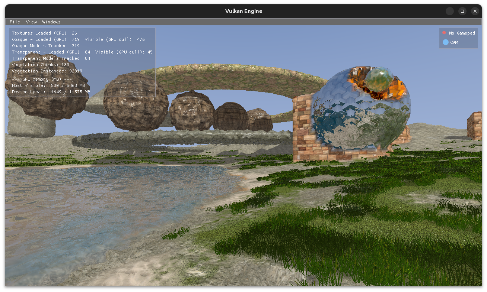

# Vulkan Engine



A real-time 3D terrain and scene rendering engine built with Vulkan 1.2+ and C++23. It combines procedural geometry generation through Signed Distance Functions and Surface Nets meshing with a full rendering pipeline covering terrain, water, vegetation, shadows, and atmospheric sky.

---

## Build and Run

### Prerequisites

- Linux with Vulkan SDK and GPU drivers installed
- `g++` with C++23 support
- `libglfw3-dev`, `libjpeg-dev`, `libgdal-dev`, `libz-dev`
- `pkg-config`
- Vulkan validation layers (`VK_LAYER_KHRONOS_validation`)
- `glslc` or `glslangValidator` for shader compilation

### Build

```sh
# Debug build (no optimizations, debug symbols)
make debug

# Release build (O3 optimizations)
make release
```

Compiled shaders are placed in `bin/shaders/`, the application binary in `bin/app`.

### Clean

```sh
make clean
```

### Run

```sh
make run
```

---

## Vulkan Techniques

### Render Passes and Pipeline Architecture

The engine uses several dedicated render passes:

- **Main render pass** — Color and depth attachments for primary scene geometry. A `continuationRenderPass` variant loads existing framebuffer state to allow multi-pass composition.
- **Shadow render pass** — Depth-only pass shared across all shadow cascade framebuffers.
- **Water geometry pass** — Renders water meshes to a per-frame offscreen depth image (`waterGeomDepthImages`) for volume thickness computation. A back-face depth pass with reversed winding captures the far-side depth for refraction.
- **Scene offscreen pass** — Color and depth rendered to `sceneColorImages` / `sceneDepthImages` before water composition.

Graphics pipelines cover: solid rendering, tessellated water, instanced vegetation with geometry shaders, sky sphere, wireframe, and debug visualization.

### Frames in Flight and Synchronization

The engine maintains up to three frames in flight using per-frame binary semaphores (`imageAvailableSemaphores`, `renderFinishedSemaphores`) and fences (`inFlightFences`) for CPU-GPU synchronization. An `imagesInFlight` map prevents writing to a swapchain image still in use by a previous frame.

All image layout transitions and memory visibility requirements are handled with `VkImageMemoryBarrier2` (synchronization2). Pipeline barriers use fine-grained stage and access masks — no full pipeline stalls. `vkDeviceWaitIdle` and `vkQueueWaitIdle` are never used inside the render loop.

### Async Queues and Command Pools

- **Graphics queue** — Primary rendering work.
- **Vegetation queue** — Dedicated async compute for vegetation instance generation.
- **Geometry queue** — Async geometry processing.

Each queue has its own command pool. Short-lived commands use a `transientCommandPool`. `submitCommandBufferAsync()` returns a fence so the caller can defer resource cleanup until GPU completion without blocking the CPU.

### Memory Management and Resource Lifetime

All CPU-to-GPU uploads (textures, buffers) go through staging buffers. Resources are never destroyed or reused before GPU completion is confirmed via fence signals. `deferDestroyUntilFence()` queues Vulkan object destruction until the associated fence is signaled. A `VulkanResourceManager` tracks all allocated objects for safe teardown.

Per-subresource image layout state is tracked in an `imageLayerLayouts` map. Pending layout updates are only applied after their fence signals to prevent layout mismatches that would trigger validation errors.

### Descriptor Sets

A unified descriptor layout with fixed bindings used across all passes:

| Binding | Content |
|---------|---------|
| 0 | Main UBO (transforms, camera, view-projection) |
| 1–3 | Sampled texture arrays (color, normal, bump) |
| 4 | Shadow map cascade 0 sampler |
| 5 | Materials SSBO |
| 6 | Sky UBO |
| 7 | Water params SSBO |
| 8–9 | Shadow map cascade 1 and 2 samplers |
| 10 | Water render UBO (time) |

### Texture Arrays

All scene textures are stored as `VK_IMAGE_VIEW_TYPE_2D_ARRAY`. The `TextureArrayManager` handles allocation, per-layer staging uploads, and layout tracking. Barriers specify `baseArrayLayer` and `layerCount` precisely — no blanket all-layer barriers unless necessary. Fragment shaders select the active layer through a `texIndex` vertex attribute.

### Indirect Rendering and GPU Frustum Culling

The `IndirectRenderer` merges all scene geometry into a single vertex buffer, index buffer, and indirect draw command buffer. A compute shader (`indirect.comp`) performs per-mesh frustum culling on the GPU and writes `VkDrawIndexedIndirectCommand` entries. Meshes can be added or removed dynamically; the buffer is rebuilt when capacity is exceeded.

### Compute Texture Mixer

Terrain surface appearance is driven by a compute shader that blends multiple texture layers using brush shapes or procedural patterns. Storage images are bound in `VK_IMAGE_LAYOUT_GENERAL` during writes. Output layers (albedo, normal, bump) are transitioned to `VK_IMAGE_LAYOUT_SHADER_READ_ONLY_OPTIMAL` with `srcStage = COMPUTE_SHADER`, `dstStage = FRAGMENT_SHADER` barriers before sampling.

---

## Octree and Spatial Partitioning

The octree in `space/` is the central data structure for scene management. Each node covers an axis-aligned bounding box and holds up to eight children.

- **SDF-driven construction** — Nodes are populated by evaluating SDFs at their corners. If the SDF spans the iso-surface, the node is subdivided. This drives the Surface Nets meshing step.
- **Shape operations** — CSG-style union and subtraction of SDF primitives modify the tree incrementally. Each change is queued through `OctreeChangeHandler` and processed asynchronously via a thread pool.
- **LOD and simplification** — Nodes carry simplification flags so distant geometry can use coarser meshes.
- **Serialization** — `OctreeSerialized` / `OctreeNodeData` allow the tree to be saved and restored.
- **Custom allocator** — `OctreeAllocator` handles node memory to avoid per-node heap allocations.
- **Height map integration** — `CachedHeightMapSurface` / `ChunkedHeightMapSurface` cache terrain height queries used during tree population, avoiding redundant SDF evaluations.

---

## Sky Sphere

The sky is rendered as a full-screen sphere pass using `sky.vert` and `sky.frag`. The fragment shader computes a vertical gradient between a configurable horizon color and zenith color, with an additional sun flare term. Sky parameters (colors, warmth, exponent, flare intensity) are uploaded via the Sky UBO (binding 6). The sky color is available to the water pass for reflection tinting.

---

## Water Rendering

Water uses a multi-pass approach with tessellation:

1. **Scene pre-pass** — The scene (without water) is rendered to offscreen color and depth images.
2. **Water geometry pass** — Water meshes are rasterized to a dedicated depth buffer. A second back-face pass captures the far-side depth for volume thickness.
3. **Tessellation pipeline** — `water.tesc` drives adaptive subdivision based on distance to camera. `water.tese` displaces vertices using layered Perlin noise (configurable scale, octaves, and persistence) to produce animated wave surfaces.
4. **Composition** — `water.frag` samples the offscreen scene color for refraction and the sky color for reflection, blending them by view angle and depth. Animated time is supplied through the Water Render UBO (binding 10).

Per-layer water parameters (tint, noise scale, octaves, persistence) are stored in an SSBO (binding 7).

---

## Vegetation

Vegetation instances are generated entirely on the GPU using a compute shader (`vegetation_instance_gen.comp`) dispatched asynchronously on the vegetation queue. The shader writes per-instance `vec4` data to an instance buffer, applying distance-based density culling.

The rendering pipeline uses:
- **`vegetation.vert`** — Reads per-instance data and positions a billboard quad.
- **`vegetation.geom`** — Emits camera-facing quads per instance.
- **`vegetation.frag`** — Samples the vegetation texture array with alpha blending.

All vegetation textures are stored as `VK_IMAGE_VIEW_TYPE_2D_ARRAY`. An `AtlasManager` organizes billboard textures and an ImGui `VegetationAtlasEditor` allows live editing. Async fences prevent instance buffer reuse before the previous GPU dispatch completes.

---

## Shadow Mapping

The engine uses cascaded shadow maps with three cascades (`SHADOW_CASCADE_COUNT = 3`). Each cascade has its own depth image, view, framebuffer, and light-space matrix. All cascades share a single depth-only render pass and shadow pipeline.

Cascade depth images are sampled in the main and water fragment shaders via bindings 8 and 9. A dummy 1×1 depth image prevents layout mismatches when cascade data is not yet available. Per-cascade layout state is tracked in the `cascadeDepthLayouts` array to ensure correct image layout transitions before each shadow pass and before sampling.

A wireframe shadow pipeline variant is available for debugging, with optional one-shot readback.

---

## Signed Distance Functions

The `sdf/` directory implements a full SDF primitive and composition library:

**Primitives** — Box, sphere, capsule, cylinder, cone, torus, octahedron, pyramid, and height-map terrain (with GeoTIFF support via GDAL).

**CSG operations:**
- Hard: union, subtraction, intersection, XOR
- Smooth: `opSmoothUnion`, `opSmoothSubtraction`, `opSmoothIntersection` (blending parameter controls transition width)

**Distortion effects:**
- **Fractal Perlin distortion** — Displaces the SDF domain with multi-octave Perlin noise (configurable frequency, octaves, lacunarity, gain) to produce eroded or organic surfaces.
- **Carve effect** — Combines Perlin noise with a threshold to punch procedural holes and erosion patterns.
- **Voronoi carve** — Voronoi-based patterning for cell-like surface detail.

Every primitive and effect has a `Wrapped*` variant, allowing arbitrary SDF trees to be composed for complex terrain generation.

**Surface Nets meshing** — The `Tesselator` evaluates each octree node's SDF at its eight corners to detect iso-surface crossings, then computes vertex positions and normals by interpolation. Material assignment is performed during tesselation by a `TexturePainter` that maps surface positions to texture array indices.


### Debug Build
To build with debug symbols and validation layers enabled:

```sh
make debug
```

## Directory Structure
- `main.cpp` — Entry point and Vulkan setup
- `math/` — Math, geometry, and spatial partitioning (octree, bounding volumes)
- `events/` — Event system for input and window management
- `bin/` — Compiled binaries and runtime files
- `shaders/`, `textures/` — Graphics assets

## License
See LICENSE for details.
# vulkan-engine
Physics Engine in Vulkan
