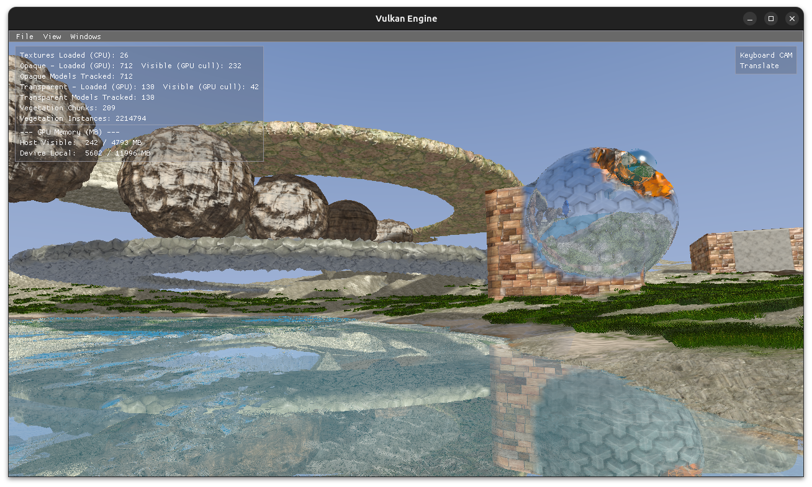

# Vulkan Engine



A real-time 3D terrain and scene rendering engine built with modern Vulkan (targeting 1.4, compatible with 1.3 through runtime feature detection) and C++23. Procedural geometry is generated from Signed Distance Functions and meshed with Surface Nets. Rendering is a hybrid rasterization + hardware ray tracing pipeline covering terrain, water, vegetation, EVSM shadows, atmospheric sky and GPU impostors.

---

## Build and Run

### Prerequisites

- Linux with Vulkan SDK and GPU drivers installed
- `g++` with C++23 support
- `libglfw3-dev`, `libjpeg-dev`, `libgdal-dev`, `libz-dev`
- `pkg-config`
- Vulkan validation layers (`VK_LAYER_KHRONOS_validation`)
- `glslc` or `glslangValidator` for shader compilation

### Build

```sh
# Debug build (no optimizations, debug symbols, validation layers)
make debug

# Release build (O3 optimizations, ImGui enabled)
make -j8 all

# Headless server (no Vulkan/UI linkage)
make server
```

Compiled shaders are placed in `bin/shaders/`, the application binary in `bin/app`, and resources are expected relative to `bin/`.

### Run

```sh
make run        # Release build + run
make run-debug  # Debug build + run
```

### Validation

Debug builds enable Khronos validation and synchronization validation. GPU-assisted validation can be enabled per run:

```sh
VULKAN_GPU_ASSISTED=1 make run-debug > logs/run.log 2>&1
```

---

## Rendering Architecture

### Dynamic Rendering

Every pass renders with dynamic rendering (`vkCmdBeginRendering` / `vkCmdEndRendering`) — there are no `VkRenderPass` / `VkFramebuffer` objects. Attachment load/store ops are selected per pass: shadow, water geometry and depth prepasses clear their own attachments, while passes that composite into existing targets use load operations.

- **Solid targets** — swapchain-format color plus `D32_SFLOAT` depth, rendered to offscreen images and composited by the post-process pass.
- **Water targets** — `R32G32B32A32_SFLOAT` color plus a dedicated water geometry depth image, with a separate back-face depth target for thickness.
- **Shadow cascades** — EVSM moment color (`R32G32_SFLOAT`) plus a `D32_SFLOAT` depth-test attachment.
- **Swapchain** — `B8G8R8A8_SRGB`, chosen at startup.

### Frames in Flight and Synchronization

The engine keeps three frames in flight. Synchronization is built on `VkSemaphore` timelines instead of per-frame binary fences:

- **Frame pacing** — each queue submit signals a strictly increasing `frameTimeline` value; the CPU waits on the oldest in-flight value at the start of a frame. `imagesInFlight` stores the timeline value that last acquired each swapchain image.
- **Async uploads** — a separate `uploadTimeline` semaphore tracks staging transfers; the graphics submission waits on the latest uploaded value.

All image layout transitions and memory visibility use `vkCmdPipelineBarrier2` (synchronization2) with fine-grained stage/access masks. `vkDeviceWaitIdle` and `vkQueueWaitIdle` are never used inside the render loop; GPU resources are retired through `deferDestroyUntilFence()` / `SubmissionTracker`.

### Parallel Queues

`SceneQueues` assigns render roles to the device's parallel graphics-queue pool, falling back to the single graphics queue when fewer queues are exposed:

| Queue | Work |
|-------|------|
| vegetation | Vegetation offscreen color/depth (billboards and impostors) |
| sdf / bbox | SDF leaf cubes and mesh bounding-box overlays |
| geometry | Geometry compute |
| solid | Main terrain/mesh pass and GPU culling dispatch |
| water | Water geometry, back-face and RT dispatch |
| sky | Sky/environment equirect |
| brush solid / brush liquid | Brush overlay passes |

Each renderer owns its command pool; short-lived work uses a shared `transientCommandPool`.

### Memory and Resource Lifetime

`VmaContext` (VMA) provides device-local and host-visible allocations. All CPU-to-GPU uploads go through a `StagingRingBuffer`, and resources are never destroyed or reused before GPU completion is confirmed with a fence or timeline wait. `deferDestroyUntilFence()` queues Vulkan object destruction behind the associated fence, and `VulkanResourceManager` tracks allocated objects for safe teardown. Per-subresource image layouts are tracked so transitions are applied only after the owning submission completes.

### Descriptors

The main scene set uses a fixed layout (25 bindings; no descriptor arrays). Bindings 14–25 are the hybrid-RT / SSR additions, written when the corresponding feature is available:

| Binding | Content |
|---------|---------|
| 0 | Per-frame UBO (transforms, camera, view-projection) |
| 1–3 | Texture arrays: albedo, normal, height/bump (tessellation displacement) |
| 4 | Shadow map cascade 0 (EVSM) |
| 5 | Materials SSBO |
| 6 | Sky UBO |
| 7 | Water params SSBO |
| 8–9 | Shadow map cascades 1 and 2 |
| 10 | Water render UBO (time) |
| 12–13 | Roughness and ambient-occlusion texture arrays |
| 14 | TLAS (proxy acceleration structure) |
| 15–16 | RT water reflection / refraction+thickness outputs |
| 17 | `RayTracingParams` UBO |
| 18 | RT proxy metadata SSBO |
| 19–20 | Previous-frame solid HDR color and depth (SSR reprojection) |
| 21–23 | Scene primitive bases, per-geometry albedo, per-geometry vertex-index lookup |
| 24–25 | Merged vertex and index pools |

Auxiliary sets bind brush depth inputs, water scene inputs (back-face depth, RT outputs, equirect sky, solid HDR/depth, vegetation color/depth), vegetation/impostor arrays and wind UBO, and the post-process composite inputs. `VK_EXT_descriptor_buffer` is used live for the post-process set and maintained as warm mirrors for the scene set; compute-heavy sets (GPU culling, texture mixer, debug) use `UPDATE_AFTER_BIND`. The required descriptor-indexing features are queried at runtime.

### Indirect Rendering and GPU Culling

`IndirectRenderer` merges scene geometry into shared vertex/index buffers and an indirect command buffer. `indirect.comp` performs per-mesh frustum culling and LoD selection on the GPU, and also drives the vegetation billboard/impostor streams, SDF debug cubes, bounding-box overlays and shadow-cascade variants. Meshes can be added and removed dynamically; buffers are rebuilt when capacity is exceeded.

### Compute Texture Mixer

`perlin_noise.comp` blends texture-array layers with brush shapes or procedural Perlin patterns, writing albedo, normal, bump, roughness and AO storage images in `VK_IMAGE_LAYOUT_GENERAL` and transitioning them to `SHADER_READ_ONLY_OPTIMAL` before sampling. Parameters are supplied through push constants.

---

## Hybrid Ray Tracing

Rasterization owns primary visibility (tessellation, displacement, LOD, water surface, vegetation, materials, depth, sky) and the EVSM cascades own the authoritative directional-sun shadows. Hardware ray tracing provides the secondary visibility representation:

- **Proxy acceleration structures** — a stable AABB proxy BLAS/TLAS built from octree chunk bounds: solid boxes (one per 4×4 height-grid cell, 8 vertices / 12 triangles each) and water boxes. Rebuilt only when the underlying chunk set changes, never on camera moves, LOD switches or tessellation changes.
- **Scene geometry BLAS** — exact chunk triangles taken from the merged raster vertex/index pools (finest non-overlapping rung), including the real water mesh. Lookup buffers resolve primitive hits to geometry and vertex pools.
- **TLAS instances** — three instances with instance masks: solid proxies, water proxies and real scene geometry. Rays choose their target set per use (solid rays see everything, water surfaces never hit themselves, shadows see proxies for shoreline contact).
- **Inline ray queries** (`VK_KHR_ray_query`) — default water path: solid reflections, water reflections/refractions (Snell IOR) and selective local/contact shadows traced from the raster shaders. Solid reflections use contribution, roughness and checkerboard ray-budget gates; misses refine with SSR or fall back to the equirect sky.
- **Async water RT pipeline** — `rt_water.rgen/.rmiss/.rchit` with a 3-record SBT and recursion depth 1, dispatched on the water queue after the water geometry pass. It traces proxy geometry and writes two half-resolution outputs (reflection; refraction + thickness) consumed with one frame of latency.

RT parameters stream through a small per-frame UBO. All ray paths are independently toggleable at runtime — solid reflections, water reflections, refractions, thickness and local/contact shadows — along with reflection/refraction distance caps, roughness threshold, self-skip distance and ray-budget mode. When ray tracing is unsupported the feature accessors report it and the raster path keeps working with the equirect environment and EVSM shadows.

---

## Shadow Mapping

Shadows use three cascaded **Exponential Variance Shadow Maps** (EVSM2):

- Cascade resolutions `{2048, 1024, 512}` with a 50/50 log-uniform split; 3-cascade constant `SHADOW_CASCADE_COUNT`.
- Per cascade: `R32G32_SFLOAT` moment targets (`exp(c·z)`, `exp(2c·z)` with `c = 2`) plus a `D32_SFLOAT` depth-test attachment; texels cleared to the far-plane moments to avoid false darkening.
- A separable 9-tap Gaussian blur post-processes cascades 0 and 1.
- Sampling uses Chebyshev's upper bound with variance clamping and light-bleeding reduction, with edge/Z blending between cascades.
- Solid terrain, water and vegetation/impostors all render into the cascades with front-face culling and depth bias. The water surface itself does not sample the cascades (RT hit shading does), but casts into them.

---

## Sky and Environment

- **On-screen sky** — a fullscreen triangle reconstructs the view ray from the inverse view-projection and shades a day/night gradient (horizon/zenith, warmth, sun flare, night colors, star intensity); a debug grid mode renders an axis-colored direction grid.
- **Environment equirect** — every frame the sky is also rendered offscreen to a 2048×1024 equirectangular texture. This single environment map serves as the post-process background, the water/RT reflection fallback and the RT miss radiance.
- Sky parameters are uploaded through the Sky UBO (binding 6).

---

## Water Rendering

Water is a four-stage tessellated pipeline (`main_water.vert/tesc/tese/frag`, built from `main.*` with `WATER_MODE`; the RT variant adds `RT_ENABLED`):

1. **Tessellation** — noise-adaptive factors with crack-free per-edge midpoints and displacement along the water normal.
2. **Shore-wave field** — directional swell plus a cross train and ridged FBM chop, shaped by measured water thickness zones: deep swell, shoaling, plunging breakers with curl/crest curvature, shallow decay and a residual shore line wave.
3. **Surface** — foam and whitewater (crest, trailing, shore and contact lines), per-layer IOR/Snell refraction with Perlin distortion, Beer-Lambert absorption, a 5-stop depth-region tint ramp (shore, foam band, breaker line, shoaling, deep ocean), Henyey-Greenstein volumetric scattering and physically derived caustics (`E/E0 = 1/|1 + d·K·d²h/du²|`) driven by the wave field.
4. **Reflections** — hardware-RT mirror rays with Fresnel, sun specular and glitter; misses refine or fall back to the equirect environment.

Composition is done by the post-process pass: the water pass renders to its own HDR target and is alpha-composited with occlusion against solid and vegetation depth, or it can be alpha-blended directly into the main pass (`Water in main pass` setting). A dedicated back-face pass captures far-side depth used for volume thickness, and a wireframe pipeline variant renders the surface for debugging. Per-layer parameters live in an SSBO (binding 7); the water time UBO is binding 10.

---

## Vegetation and Impostors

- **Instance generation** — CPU-side, per finest chunk: area-weighted virtual slots with unbiased stochastic rounding, biome noise, steep-face filtering and shuffled submission into device-local instance buffers, drained a few chunks per frame.
- **Billboards** — vertex-shader expanded crossed planes (no geometry shader), three billboard types, alpha from an opacity/normal-confidence sigmoid.
- **Impostors** — beyond `impostorDistance`, pre-captured impostors replace billboards: 20 Fibonacci camera views × 3 billboard types captured to 60-layer albedo, normal and depth arrays. Depth is reprojected per fragment for correct deferred depth and shadow casting, and a dither cross-fade blends billboards into impostors.
- **Pipelines** — shading, depth prepass, EVSM shadow and impostor color/depth/shadow variants. Culling and compaction run on the GPU through the shared indirect dispatcher.
- **Editing** — `AtlasManager` slices billboard atlases (auto-detected tiles) and `VegetationAtlasEditor` edits them live; `BillboardService` bakes composed layers into the three texture arrays that `ImpostorService` captures from.

---

## Post-Processing

A single fullscreen composite (`postprocess.frag`) assembles the frame: equirect sky background, solid color, vegetation color (depth-tested), water (occlusion against scene/vegetation depth and the raw water geometry depth), brush overlays, and debug SDF/box overlays. The pass has no tonemapping or bloom; it writes linear color to the sRGB swapchain. It runs through a descriptor-buffer set with per-slot write caching.

---

## Signed Distance Functions

The `sdf/` directory implements a full SDF primitive and composition library:

**Primitives** — Box, sphere, capsule, tapered capsule, cylinder, tapered cylinder, cone, torus, octahedron, pyramid, triangle strip, sweep, road spline, and height-map terrain (with GeoTIFF support via GDAL).

**CSG operations:**
- Hard: union, subtraction, intersection, XOR
- Smooth: `opSmoothUnion`, `opSmoothSubtraction`, `opSmoothIntersection` (blending parameter controls transition width)

**Distortion effects:**
- **Fractal Perlin distortion** — displaces the SDF domain with multi-octave Perlin noise (frequency, octaves, lacunarity, gain) to produce eroded or organic surfaces.
- **Perlin carve** — combines Perlin noise with a threshold to punch procedural holes and erosion patterns.
- **Voronoi carve** — Voronoi-based patterning for cell-like surface detail.
- **Sine distortion** — wavy sinusoidal domain displacement.

Every primitive and effect has a `Wrapped*` variant, allowing arbitrary SDF trees to be composed for complex terrain generation.

**Surface Nets meshing** — the `Tesselator` evaluates each octree node's SDF at its eight corners, detects iso-surface crossings and computes vertex positions and normals by interpolation, with triplanar UVs and material assignment through a `TexturePainter` that maps surface positions to texture array indices.

---

## Octree and Spatial Partitioning

The octree in `space/` is the central data structure for scene management. Each node covers an axis-aligned bounding box and holds up to eight children.

- **SDF-driven construction** — nodes are populated by evaluating SDFs at their corners. If the SDF spans the iso-surface, the node is subdivided; this drives the Surface Nets meshing step.
- **Shape operations** — CSG-style union and subtraction of SDF primitives modify the tree incrementally. Each change is queued and processed asynchronously through an `Octree` thread pool.
- **LOD and simplification** — nodes carry simplification flags so distant geometry can use coarser meshes; `Simplifier` collapses child geometry into parents by angle/distance/texture criteria, and `MeshSimplifier` provides vertex-cluster decimation.
- **Visibility** — `OctreeVisibilityChecker` maintains the visible node set with frustum and view-direction culling and sorted octant traversal.
- **Serialization** — `OctreeFile` and `OctreeSerialized` / `OctreeNodeData` save and restore trees (also JSON/BSON export).
- **Custom allocator** — `OctreeAllocator` handles node memory to avoid per-node heap allocations.
- **Height map integration** — `CachedHeightMapSurface` / `ChunkedHeightMapSurface` cache terrain height queries used during tree population.

---

## Directory Structure

| Path | Description |
|------|-------------|
| `MyApp.cpp` | Entry point (`MyApp` extends `VulkanApp`) |
| `server.cpp` | Headless server entry point |
| `vulkan/` | Vulkan setup, resource management, renderers |
| `vulkan/renderer/` | SceneRenderer, SolidRenderer, SkyRenderer, WaterRenderer, WaterBackFaceRenderer, ShadowRenderer, VegetationRenderer, IndirectRenderer, PostProcessRenderer, RayTracingResources, ImpostorCapture, WireframeRenderer, BrushRenderer and debug renderers |
| `vulkan/ubo/` | GPU uniform buffer structs |
| `vulkan/includes/` | Shared C++ headers (locations, vertex layouts, debug modes) |
| `space/` | Octree, Tesselator (Surface Nets), Simplifier, MeshSimplifier, ThreadPool, ConcurrentQueue, OctreeVisibilityChecker, OctreeFile |
| `sdf/` | SDF primitives, CSG operations and distortion effects (HeightMap, RoadSpline, OctreeDifference, Wrapped* variants) |
| `events/` | Input system (keyboard, gamepad, nunchuk), EventManager |
| `math/` | Camera, Light, BoundingBox, Frustum, Plane, Ray, HeightMap, PerlinSurface, Brush3d |
| `services/` | TextureMixer, BillboardService, ImpostorService |
| `widgets/` | ImGui debug/editor UI (release builds only): settings, water, texture mixer/viewer, render targets, queue timeline |
| `tree/` | AttractorField, TreeGenerator, TreeHandler |
| `utils/` | LocalScene, MainSceneLoader, FileReader, SettingsFile, AtlasManager, brush system, parameter structs |
| `shaders/` | GLSL shader sources compiled to SPIR-V |
| `textures/` | Texture assets |
| `docs/` | Documentation |
| `third_party/` | Vendored libraries (ImGui, miniaudio, wiiuse, Vulkan headers) |

## License
See LICENSE for details.
